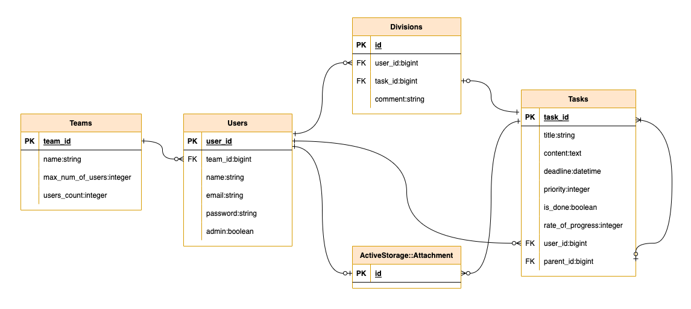

[](https://github.com/daytwist/divwork/actions/workflows/frontend.yml) [](https://github.com/daytwist/divwork/actions/workflows/backend.yml)

# DivWork
https://divwork.net


<br/>

## サービス概要
DivWorkはチーム作業のためのタスク管理ツールです。チーム全体のタスクの状況把握、タスク作成/更新、メンバーへのタスク分担をすることが出来ます。

<br/>

## ターゲットユーザー
チームで作業をする方 (事務職、開発職など)

<br/>

## なぜこのサービスを作ったのか
私はメーカーに勤めており、チームで設計開発業務をしています。チームのタスクはExcelで管理していましたが、手作業で作成/更新するため手間が掛かること、各々の業務量が見えにくいためタスクを分担しづらいことに困っていました。そこで、チーム作業のためのタスク管理ツールを作成して課題を解決したいと考え、DivWorkを作成しました。

<br/>

## こだわりポイント
**1. チームタスクの可視化**

チームページではメンバーのタスク件数をグラフ表示しています。これにより一目でメンバーのタスク件数が分かるため、新しいタスクを配分しやすくなります。

**2. シンプルな操作性**

説明文が無くても直感的に操作出来るようなデザインを心掛けて作成しています。操作に迷うことなく短時間でタスク作成/更新処理が出来ます。

**3. タスク分担機能**

タスクをチームのメンバーに分担することが出来ます。分担タスクは元のタスクをコピーして新規作成しますが、編集したりコメントを追加したりすることが出来ます。

自分のタスクだけなく、他メンバーのタスクを分担することも可能です。

<br/>

## 機能一覧
- ユーザー作成、編集、削除機能
- ユーザー画像登録機能
- ログイン、ログアウト機能
- ゲストログイン機能
- チーム作成、編集機能 (管理者権限)
- タスク作成、編集、削除機能
- チームタスクグラフ化機能
- 分担作成、履歴機能

<br/>

## 使用技術
**backend**
- Ruby 3.1.2
- Ruby on Rails 6.1.6
  - RuboCop
  - RSpec
  - Devise Token Auth
  - Active Storage

**frontend**
- TypeScript 4.4.2
- React 18.1.0
  - ESLint
  - Prettier
  - Jest
  - Testing Library
  - Axios
  - MUI
  - Emotion
  - Recharts

**インフラ**
- MySQL 8.0.30
- Nginx
- Puma
- Docker/Docker Compose
- AWS EC2/RDS/S3/VPC/ELB/Route53/ACM

**CI/CD**
- Github Actions

<br/>

## 画面遷移図
https://www.figma.com/file/pAoXCDwvvRGQLwRekIkFmG/%E7%94%BB%E9%9D%A2%E9%81%B7%E7%A7%BB%E5%9B%B3?node-id=0%3A1

<br/>

## ER図


<br/>

## インフラ構成図


## Dockerを用いた開発環境の再現手順
1. リポジトリをクローンする

```bash
git clone https://github.com/daytwist/divwork.git
```

<br/>

2. .envファイルを作成する

`frontend/.env`

```properties
REACT_APP_NODE_ENV="development"
REACT_APP_API_DOMAIN="http://localhost:3001/api/v1"
REACT_APP_API_DOMAIN_IMAGE="http://localhost:3001"
```

`backend/.env`

```properties
API_DOMAIN="http://localhost:3000"
```

<br/>

3. コンテナを作成&起動する

```
make build
```

<br/>

4. データベース&テストデータを作成する

```
make db
```

`http://localhost:3000`にアプリが表示される。

<br/>

5. コンテナを停止する

```
make stop
```

<br/>

6. コンテナ&ボリュームを削除する

```
make down
```

<br/>

## 今後の予定
- タスクウェイト表示機能作成
- タスクファイル添付機能作成
- 管理者権限によるユーザー追加/削除機能作成
